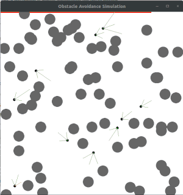

# EvolutiveSystemOpenGL-ObstacleAvoidance
<center>



</center>

Parallel evolution study of sensors and brain. I am using OpenGL to simulate and Qt to generate graphs.

# Installation
First, you need to download the OpenGl and Glut:
```
$ sudo apt-get install mesa-common-dev
$ sudo apt-get install freeglut3-dev

```

TODO
